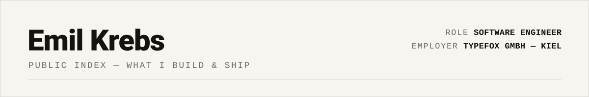
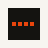

<small><strong>01 — LIVE PRODUCTS</strong></small>

<table>
<tr>
<td width="33%" valign="top">
 
<strong><a href="https://vailnote.com">VailNote</a></strong> 
Privacy-first note &amp; secret sharing, zero-knowledge by design. 
<code>Deno · TypeScript</code> · <a href="https://github.com/emilkrebs/VailNote">source ↗</a>
</td>
<td width="33%" valign="top">
 
<strong><a href="https://play.google.com/store/apps/details?id=com.emilkrebs.watchlock">WatchLock</a></strong> 
Lock your phone from your watch. 
<code>Kotlin · Android</code> · <a href="https://github.com/emilkrebs/WatchLock">source ↗</a>
</td>
<td width="33%" valign="top">
 
<strong><a href="https://emilkrebs.dev">emilkrebs.dev</a></strong> 
Personal site, set like a printed language specification. 
<code>Next.js · MDX</code> · <a href="https://github.com/emilkrebs/emilkrebs.dev">source ↗</a>
</td>
</tr>
</table>

<small><strong>02 — ARCHIVE</strong> — <a href="https://github.com/emilkrebs/Generator-Discord">Generator-Discord</a>, Discord bot scaffolder on <a href="https://npmjs.com/package/generator-discord">npm</a> · Spigot plugins · Discord bots (2022–2024, archived).</small>

<small><strong>03 — INDEX</strong> — <a href="https://emilkrebs.dev">site</a> · <a href="https://github.com/emilkrebs">github</a> · <a href="https://www.linkedin.com/in/emilkrebs/">linkedin</a> · <a href="https://medium.com/@emilkrebs">medium</a></small>

